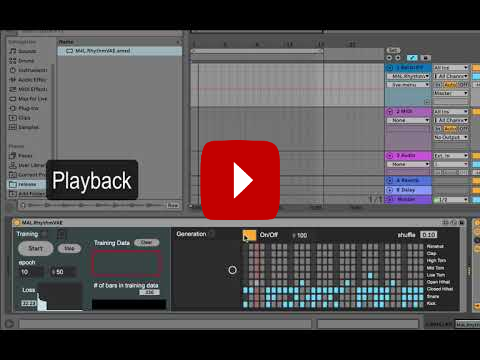
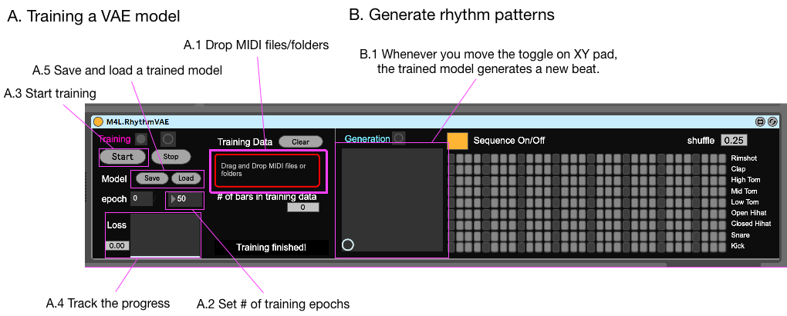

# RhythmVAE_M4L
Max for Live(M4L) Rhythm generator using Variational Autoencoder(VAE) 

## How it works

 Device")

If you want to quickly test the device, please use the one in `/release` directory.

## Requirement
- You need to update your Node for Max package to the latest version (version 1.2.3 or later) through Package Manager, or use the latest version of Max (8.1.0 or later)
- Currently the device supports Mac OS only.  

## Known problems
~~- When you keep generating rhythms continuiously, Node for Max crashes with "Max API Timeout" error in some occasions and you'll see "Model is not trained yet" error message.~~
- Incompatible with folders with names containing special characters such as `[]?*!|@`
- Changes you make on the sequence grid view are not reflected the rhythm sequence. It is just a display! 

## TO DO
- Fix "Max API Timeout" error
- ~~save/load functionaly for trained models~~
- better documentation
- better UI design!!
- custom MIDI note number settings
- add a feature to add random noise to `z` 

## Updates
- 2019.11.10 added| Time shift parameter / MIDI Mapping
- 2019.10.19 fixed| beat sync issue
- 2019.10.18 added| note on the requirement
- 2019.9.14 added| functionality to save/load trained model 

## MIDI Mapping

This devices considers the following 9 drum types:

  | Drum Types |
  |:-----:|
  | Kick  |
  | Snare |
  |Hi-hat closed |
  |Hi-hat open |
  |Tom low|
  |Tom mid|
  |Tom high|
  |Clap|
  |Rim|

MIDI notes in a MIDI file will be classified into the 9 types based on [General MIDI (GM) Mapping](https://www.midi.org/specifications-old/item/gm-level-1-sound-set).

 | MIDI Note Number | Drum Type | 
 |:-----:|:-----:|
 | 36| Kick |
 | 35| Kick | 
  | 38| Snare | 
   | 27| Snare | 
  |  28| Snare | 
   | 31| Snare | 
  |  32| Snare | 
  |  33| Snare | 
  |  34 | Snare | 
  |  37| Snare | 
  |  39| Snare | 
  |  40| Snare | 
  |  56| Snare | 
   | 65| Snare | 
  |  66| Snare | 
  |  75| Snare | 
| 85| Snare | 
|  42| Hi-hat closed | 
|   44| Hi-hat closed | 
 | 54| Hi-hat closed | 
 | 68| Hi-hat closed | 
 | 69| Hi-hat closed | 
 | 70| Hi-hat closed | 
 | 71| Hi-hat closed | 
 | 73| Hi-hat closed | 
 | 78| Hi-hat closed | 
 | 80| Hi-hat closed | 
 | 46| Hi-hat open | 
 | 67| Hi-hat open | 
 | 72| Hi-hat open | 
 | 74| Hi-hat open | 
 | 79| Hi-hat open | 
 | 81| Hi-hat open | 
 | 45| Tom low | 
 | 29| Tom low | 
 | 41| Tom low | 
 | 61| Tom low | 
 | 64| Tom low | 
 | 84| Tom low | 
 | 48| Tom mid | 
 | 47| Tom mid | 
 | 60| Tom mid | 
 | 63| Tom mid | 
 | 77| Tom mid | 
 | 86| Tom mid | 
 | 87| Tom mid | 
 | 50| Tom high | 
 | 30| Tom high | 
 | 43| Tom high | 
 | 62| Tom high | 
 | 76| Tom high | 
 | 83| Tom high | 
 | 49|Clap | 
 | 55|Clap | 
 | 57|Clap | 
 | 58|Clap | 
 | 51| Rim |  
 | 52| Rim |  
 | 53| Rim |  
 | 59| Rim | 
 | 82| Rim |  