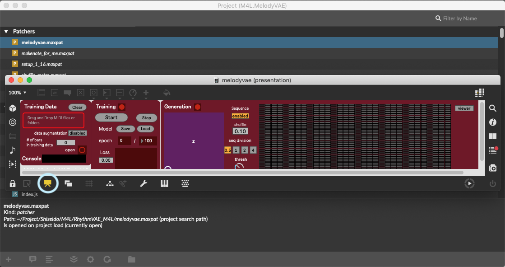
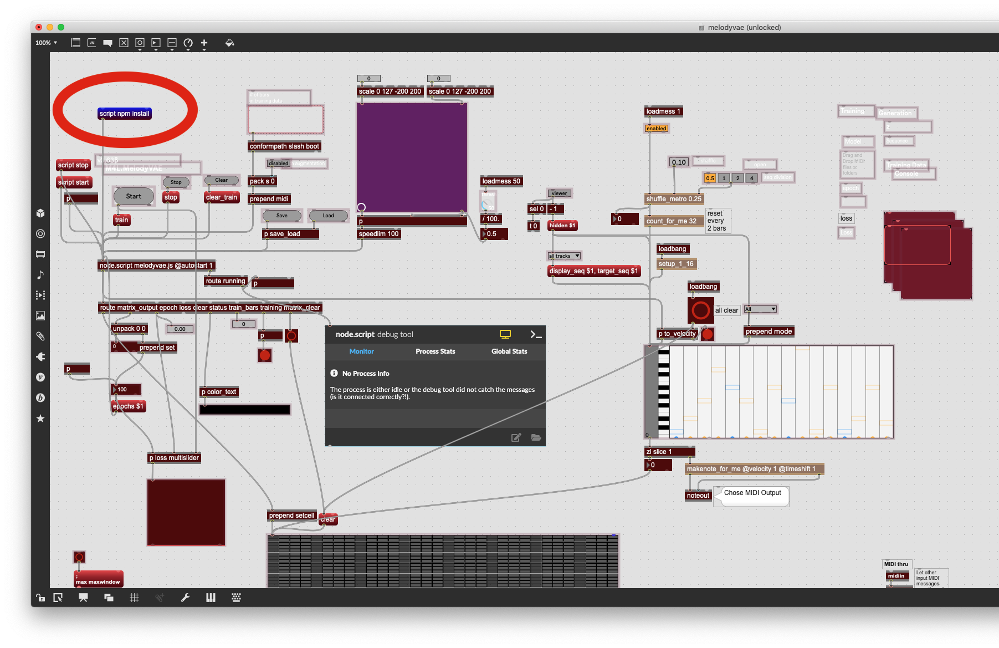
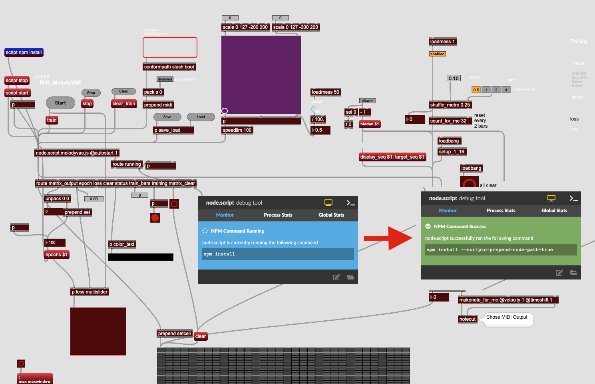
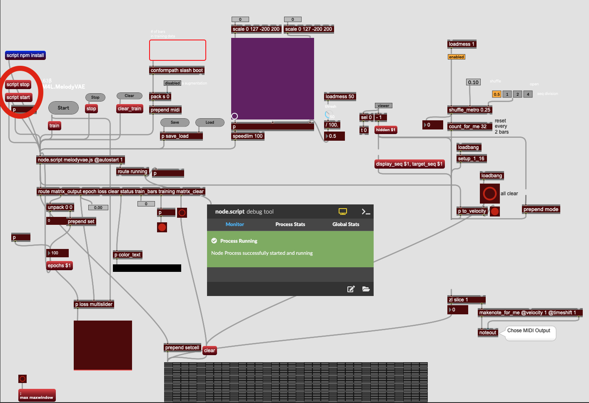

# RhythmVAE_M4L
Max for Live(M4L) Rhythm generator using Variational Autoencoder(VAE) 

## How it works

 Device")

If you want to quickly test the device, please use the one in `/release` directory.

## Requirement
You need to update your Node for Max package to the latest version (version 1.2.3 or later) through Package Manager, or use the latest version of Max (8.1.0 or later)

## Known problems
~~- When you keep generating rhythms continuiously, Node for Max crashes with "Max API Timeout" error in some occasions and you'll see "Model is not trained yet" error message.~~
- Incompatible with folders with names containing special characters such as `[]?*!|@`

## TO DO
- Windows version
- ~~save/load functionaly for trained models~~
- better documentation
- add a feature to add random noise to `z` 
- try LSTM
- add evaluation loss
- check shuffled indices 

## Updates
- 2019.10.19 fixed: beat sync issue
- 2019.10.18 added: note on the requirement
- 2019.9.14 added: functionality to save/load trained model 

## Start edits

This project depends some npm packages. So first, you need to install there.

1. To open _M4L.MelodyVAE -> M4L.MelodyVAE.maxproj_
2. Also to open _melodyvae.maxpat_ from project window and disable Presentation Mode
    
3. when click `scirpt npm install`, start install packages to _./node_modules_
    
4. When success to install, node debug tool shows like below
    
5. Click `script start` to check script running, debug tool shows like below 
    
6. Click `script stop` well done.

This process may fix export error or script error.
